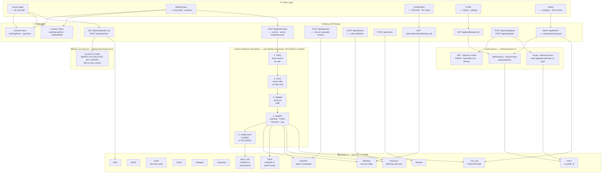

<div align="center">


# 🎟️ TicketFlow

**A full-stack event ticketing platform built for speed, safety, and scale.**

Browse events → Select seats → Pay → Get a QR ticket. Concurrency-safe, transaction-backed, zero race conditions.

[Getting Started](#getting-started) · [Architecture](#architecture) · [API Reference](#api-reference) · [Load Testing](#load-testing) · [Roadmap](#roadmap)


</div>

---

## ✨ Features

| Area | What it does |
|---|---|
| **Seat Selection** | Real-time seat map with 8s polling, server-side hold locks, conflict detection |
| **Atomic Booking** | Single DB transaction — Booking + Tickets + Payment + Discount in one shot |
| **QR Tickets** | Generated on confirmation; scannable at the gate via admin scanner UI |
| **Admin Dashboard** | Event management, revenue analytics, gate check-in |
| **Concurrency Safety** | Unique DB constraints + seat lock service; verified with a 25-user load test |
| **Auth** | JWT in httpOnly cookies; no NextAuth, no OAuth — just 150 lines that work |

---

## Tech Stack

```
Frontend    Next.js 16 (App Router) · React Server Components · Tailwind · Framer Motion + GSAP · Zustand
Backend     Next.js API Routes · MySQL via mysql2/promise · JWT · bcrypt
Validation  Zod (everywhere)
Database    MySQL 8 — raw SQL, no ORM
```

> **No NextAuth. No Prisma.** Both add dependencies and learning overhead that this scale doesn't justify. The auth layer is ~150 lines; the query layer is plain SQL.

---

## Getting Started

### Prerequisites

- Node.js ≥ 18
- MySQL 8 database named `ticket_booking_system`

### Installation

```bash
# 1. Clone and install
git clone https://github.com/your-org/ticketflow.git
cd ticketflow
npm install

# 2. Configure environment
cp .env.example .env.local
```

Edit `.env.local`:

```env
DB_HOST=localhost
DB_USER=root
DB_PASSWORD=your_password
DB_NAME=ticket_booking_system
AUTH_SECRET=         # openssl rand -base64 32
```

```bash
# 3. Apply schema (run once)
mysql -u root -p ticket_booking_system < scripts/01_schema_patches.sql

# 4. Start dev server
npm run dev
```

Open [http://localhost:3000](http://localhost:3000).

### Seeding an Admin User

**Option A — SQL direct:**

```sql
-- 1. Generate a bcrypt hash for your password first (cost factor 10+)
INSERT INTO Users (name, email, phone, password, is_admin)
VALUES ('Your Name', 'you@example.com', '9000000000', '<bcrypt-hash>', 1);

INSERT INTO Admin (name, email)
VALUES ('Your Name', 'you@example.com');
```

**Option B — Sign up then promote:**

```bash
# Register via /auth/register, then run:
mysql -u root -p ticket_booking_system <<'SQL'
  UPDATE Users SET is_admin = 1 WHERE email = 'you@example.com';
  INSERT INTO Admin (name, email)
    SELECT name, email FROM Users WHERE email = 'you@example.com';
SQL
```

---

## Architecture

The system is divided into three layers — **Client**, **Server**, and **Data** — with a strict one-way dependency: the client talks only to API routes, API routes talk only to the service/query layer, and only the service layer touches MySQL.



> **★ UNIQUE constraint** enforced at DB level — the real safety net against double-bookings.
> **i INDEX** on hot query columns — matches every frequent read path.

---

### Auth — JWT in an httpOnly Cookie

All auth lives in `lib/auth/session.ts` (~150 lines).

- Login signs an **HS256 JWT** containing `{ user_id, email, name, is_admin }`
- Delivered via `Set-Cookie: session=...; HttpOnly; SameSite=Lax; Secure`
- Server helpers `getSession()`, `requireUser()`, `requireAdmin()` read and verify it
- **The client never sees the token**

**Plaintext password migration:** Legacy seed data used plaintext passwords. The login route detects bcrypt vs. plaintext via regex and auto-upgrades on successful login — zero downtime migration.

---

### Booking — One Transaction, Server-Computed Price

The original flow made **4 sequential client-side POSTs** (`/booking` → `/ticket` × N → `/payment` → `/booking-discount`). Any failure mid-flight left the DB inconsistent. Worse, the client sent the payment `amount` — trivially exploitable.

The new `/api/book-ticket` route does all of this atomically:

```
1. Verify user owns active locks on every requested seat
2. Look up seat numbers + compute price server-side from SEAT_PRICE config
3. Validate discount code against the DB
4. INSERT: Booking → Tickets → Payment → Booking_Discount → Transaction_Log
5. DELETE seat locks
6. COMMIT — or ROLLBACK on any failure
```

Returns `409 Conflict` with the conflicting seat list so clients can recover gracefully.


---

### Seat Locks — Atomic Acquire

`lib/services/seatLock.ts` — backed by `Seat_Lock` table with `UNIQUE(seat_id, event_id)`.

**Acquire flow:**

```
BEGIN TRANSACTION
  → Sweep expired locks for requested seats
  → SELECT ... FOR UPDATE — inspect remaining locks
  → Reject if any lock belongs to another user          → 409
  → Reject if a Ticket already exists for these seats   → 409
  → INSERT ... ON DUPLICATE KEY UPDATE (claim or refresh)
COMMIT
```

If two users race for the same seat simultaneously, exactly **one wins**. The other receives a `409` with the conflicting seat IDs.

---

### Schema Patches — Preventing Entire Bug Classes

`scripts/01_schema_patches.sql` adds:

| Constraint / Index | Table | Why it matters |
|---|---|---|
| `UNIQUE(event_id, seat_id)` | `Ticket` | The actual double-booking guard — `FOR UPDATE` on a non-existent row provides no protection |
| `UNIQUE(seat_id, event_id)` | `Seat_Lock` | Enables atomic upsert; prevents duplicate locks |
| `is_admin` flag | `Users` | Replaces the spoofable `x-admin-email` request header |
| Index on `booking_date` | `Booking` | Matches the hot query path for user booking history |
| Index on `event_date` | `Event` | Fast upcoming-events filter |
| Index on `(booking_id, seat_id)` | `Ticket` | Efficient ticket lookup by booking |
| Index on `expiry_time` | `Seat_Lock` | Fast sweep of expired locks |

> **The unique constraint on `Ticket` is the real safety net.** Application-level locks are defence-in-depth; the DB constraint is what actually prevents double-bookings.

---

### Seat Map — Real-Time Without WebSockets

The seat picker polls `/api/seats/[event_id]` every **8 seconds** while a user is selecting.

- No WebSocket infrastructure
- Latency indistinguishable to the user at this scale
- To upgrade: swap `setInterval` for a Server-Sent Events stream on the same endpoint

---

### Analytics Dashboard

`/api/admin/analytics` runs **6 aggregation queries in parallel:**

- KPIs (total revenue, bookings, tickets sold)
- Revenue by event
- Revenue by category
- Revenue by payment method
- 30-day daily trend
- Top events by occupancy

All revenue is keyed off `Payment.status = 'Completed'` — abandoned bookings never pollute the numbers. The UI renders charts using **custom SVG** — no chart library dependency.

---

### QR Ticket Validation

Admin scanner UI at `/admin/scanner`:

1. **Inspect** — paste or scan a QR code to preview ticket details (event, seat, holder, payment status)
2. **Check In** — mark the ticket used; recorded in `Transaction_Log` with `action_type = 'CHECKIN-{ticket_id}'`
3. **Re-scan detection** — already-checked-in tickets are flagged immediately

For live venues, the paste input already accepts USB barcode readers (they present as keyboards). Camera-based scanning: drop in `html5-qrcode`.

---

## Project Structure

```
app/
├── (app)/                        Shared navbar/footer layout group
│   ├── admin/
│   │   ├── page.tsx              Event management + bookings table
│   │   ├── analytics/page.tsx    Revenue charts + KPIs
│   │   ├── scanner/page.tsx      QR check-in
│   │   └── layout.tsx            Tab nav + admin guard
│   ├── booking/[event_id]/
│   │   └── BookingClient.tsx     Seat picker → review → payment flow
│   ├── confirmation/[booking_id]/page.tsx
│   ├── events/                   Listing + detail pages
│   └── profile/                  Bookings, reviews, settings
│
api/
├── auth/{login,signup,logout,me}/route.ts
├── admin/{events,bookings,analytics,validate-ticket}/route.ts
├── book-ticket/route.ts          Atomic booking endpoint
├── seats/{[event_id],lock}/route.ts
└── events/[id]/route.ts
│
lib/
├── auth/session.ts               JWT helpers, requireUser, requireAdmin
├── services/seatLock.ts          Acquire / release / validate locks
├── queries/                      Read-only DB queries
├── store/                        Zustand stores (user, booking)
├── validations/                  Zod schemas
├── hooks/                        useBookingFlow, useSeatMap
├── utils/                        formatDate, formatPrice, generateQR
└── db.ts                         mysql2 connection pool
│
components/
├── payment/PaymentStep.tsx       Card form, OTP modal, atomic submit
├── confirmation/Ticket3D.tsx     Animated QR ticket
└── layout/ ui/ shared/
│
scripts/
├── 01_schema_patches.sql         Run once on new DB
└── load-test-booking.mjs         Concurrency proof
```

---

## Load Testing

Proves concurrency safety under simultaneous competing requests.

```bash
# Terminal 1
npm run dev

# Terminal 2
EVENT_ID=1 SEAT_ID=1 CONCURRENT=25 node scripts/load-test-booking.mjs
```

Spins up **25 concurrent users**, each attempting to book the same seat at the same instant.

```
────────── Results ──────────
Total time:       312ms
Successes (201):  1
Conflicts (409):  24
Lock rejections:  0
Other:            0
──────────────────────────────
✅ PASS — Exactly one booking succeeded. Concurrency is safe.
```

Set `FULL_FLOW=1` to stress the lock service path. Without it, requests go directly to `/api/book-ticket` and stress the unique constraint.

---

## API Reference

### Auth

| Method | Endpoint | Description |
|---|---|---|
| `POST` | `/api/auth/login` | Sign in, set session cookie |
| `POST` | `/api/auth/signup` | Register new user |
| `POST` | `/api/auth/logout` | Clear session cookie |
| `GET` | `/api/auth/me` | Get current session user |

### Events & Seats

| Method | Endpoint | Description |
|---|---|---|
| `GET` | `/api/events/[id]` | Event detail |
| `GET` | `/api/seats/[event_id]` | Seat map with lock status |
| `POST` | `/api/seats/lock` | Acquire seat hold (10 min TTL) |

### Booking

| Method | Endpoint | Description |
|---|---|---|
| `POST` | `/api/book-ticket` | Atomic booking (all-or-nothing) |
| `GET` | `/api/confirmation` | Booking confirmation + QR |

### Admin

| Method | Endpoint | Description |
|---|---|---|
| `GET/POST` | `/api/admin/events` | List / create events |
| `GET` | `/api/admin/bookings` | All bookings with filters |
| `GET` | `/api/admin/analytics` | Revenue + occupancy KPIs |
| `POST` | `/api/admin/validate-ticket` | Check-in a QR ticket |

---

## Environment Variables

| Variable | Required | Description |
|---|---|---|
| `DB_HOST` | ✅ | MySQL host |
| `DB_USER` | ✅ | MySQL user |
| `DB_PASSWORD` | ✅ | MySQL password |
| `DB_NAME` | ✅ | Database name |
| `AUTH_SECRET` | ✅ | JWT signing secret (`openssl rand -base64 32`) |
| `SEAT_PRICE` | — | Price config map (defaults in code) |

---

## Roadmap

**Planned:**

- [ ] `Ticket.used_at` timestamp column — replace Transaction_Log lookup with a single column
- [ ] Signed QR codes (HMAC over `booking_id|seat_id|secret`) for offline scanner verification
- [ ] Refund flow + `Payment.refunded_at`
- [ ] Per-event seat pricing stored in DB (currently a config map)
- [ ] Rate limiting on `/api/auth/login` and `/api/seats/lock`

**Deliberately not planned:**

- **WebSockets for the seat map** — polling is cheaper; the UX is identical at this scale
- **Separate service layer** — `lib/queries/` already serves this role cleanly
- **Redis for seat locks** — MySQL row-level locks handle thousands of concurrent users; add Redis only when you have profiler evidence of contention

---

## Contributing

1. Fork the repo
2. Create a feature branch: `git checkout -b feat/your-feature`
3. Commit with conventional commits: `git commit -m "feat: add offline QR validation"`
4. Open a pull request

Please run the load test before submitting changes to the booking or seat lock flow.

---

## License

Yash © 2025 TicketFlow Contributors
